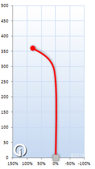

Hyzer
=====

Reverse Engineering plot data from images from inboundsdiscgolf.com.

Inspiration
=====
I wanted to be able to visualize disc golf flight data in more interesting ways than
just the traditional flight path charts. Unfortunately, the information I need is in
the form of (x,y) plots in image formats, which makes it difficult to transform. This 
project is an attempt to extract that information from the charts and present it to the
public.

